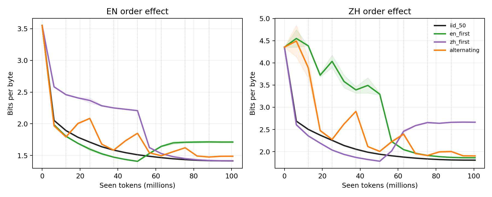

# Haidass 中英双语小模型实验报告

这是 Haidass 论文项目的公开实验报告仓库。建议第一次阅读时直接打开：

## 中英翻译 SFT 实验准备方案

未来的 Haidass1.5-143M 简体中文↔英文翻译 SFT 调研、训练配置、数据登记表和冻结评测协议已经整理在 [`SFT/Translate/`](SFT/Translate/README.md)。

- [`BEGINNER_EXPERIMENT_PREP_CN.md`](SFT/Translate/BEGINNER_EXPERIMENT_PREP_CN.md)：面向第一次做翻译模型的读者，解释数据内容、训练过程、指标和消融目的；
- [`TECHNICAL_PLAN_CN.md`](SFT/Translate/TECHNICAL_PLAN_CN.md)：100 万句对 4090 先导实验与 800 万句对集群实验方案；
- [`DATASET_REGISTRY.json`](SFT/Translate/DATASET_REGISTRY.json)：训练候选、评测隔离、许可证状态和污染风险；
- [`EXPERIMENT_MATRIX.csv`](SFT/Translate/EXPERIMENT_MATRIX.csv)：13 组基线及消融；
- [`configs/`](SFT/Translate/configs)：预注册训练配置。

这些是尚待执行的实验计划，所有结果位置均明确标注为“待跑”，不包含虚构分数。

## [从零解释：为什么做、数据是什么、怎么训练验证、结果代表什么](reports/p0_scaled_100m_all_sources_2080ti/EXPERIMENT_REPORT_BEGINNER_CN.md)

这份解释版不要求读者了解语言模型或统计学。它详细说明：

- 五个训练数据仓库里面分别是什么内容；
- 为什么五个仓库会拆成 16 路训练数据；
- 文档怎样清洗、去重、分词，并切成 1,024-token 序列；
- 训练集、验证集、测试集怎样隔离；
- 六种语言顺序实验分别想回答什么；
- BPB、遗忘量、随机种子和标准差是什么意思；
- 每个结果应该怎样理解，哪些结论目前不能说；
- 下一轮集群实验和 143M 确认实验应该怎样设计。

## 一句话结论

在这个 43.46M 参数、两个随机种子、每 run 100.66M tokens 的 RTX 2080 Ti 先导实验中，**持续随机混合中英文比三种分块顺序更好**。长时间先训练一种语言、再切换到另一种语言会造成明显遗忘；中文在“先中文、后英文”时受到的损害尤其大。

| 双语条件 | 英文测试 BPB | 中文测试 BPB | 中英等权平均 | 相对 IID |
|---|---:|---:|---:|---:|
| IID 50:50 随机混合 | **1.4191 ± 0.0038** | **1.7885 ± 0.0043** | **1.6038 ± 0.0040** | 基准 |
| 八块交替 | 1.4954 ± 0.0021 | 1.8896 ± 0.0012 | 1.6925 ± 0.0016 | 差 5.53% |
| 先英文后中文 | 1.7303 ± 0.0188 | 1.8430 ± 0.0013 | 1.7866 ± 0.0100 | 差 11.40% |
| 先中文后英文 | 1.4189 ± 0.0023 | 2.6592 ± 0.0073 | 2.0391 ± 0.0025 | 差 27.14% |

## 实验边界

这不是 Haidass1.5-143M 本体的重训结果，而是 43.46M 参数代理模型的本地先导实验。它覆盖 Haidass 模型卡列出的全部五个数据仓库和 16 个 source/configuration 流，但使用固定 shard 组成的受控配比，不声称复刻未公开的 400B-token 原始混合方案。

两个随机种子只足以检查方向是否重复，不足以支持正式显著性结论。内部 BPB 也不能代替下游问答、推理和中英配对任务。报告中的主张均按这一证据边界表述。

## 仓库内容

- [`EXPERIMENT_REPORT_BEGINNER_CN.md`](reports/p0_scaled_100m_all_sources_2080ti/EXPERIMENT_REPORT_BEGINNER_CN.md)：面向初学者的完整中文解释；
- [`EXPERIMENT_REPORT_CN.md`](reports/p0_scaled_100m_all_sources_2080ti/EXPERIMENT_REPORT_CN.md)：紧凑、严格的实验记录；
- [`figures/`](reports/p0_scaled_100m_all_sources_2080ti/figures)：训练 loss、验证 BPB、顺序效应和最终双语权衡图；
- [`tables/`](reports/p0_scaled_100m_all_sources_2080ti/tables)：逐 seed、聚合结果和等语言曝光分解 CSV；
- [`p0_scaled_100m_all_sources_2080ti_run_audit.json`](reports/p0_scaled_100m_all_sources_2080ti_run_audit.json)：12 个 run 的完整性审计；
- [`HAIDASS_DATASET_INVENTORY_CN.md`](reports/HAIDASS_DATASET_INVENTORY_CN.md)：上游数据规模、配置、revision、许可证与本地覆盖清单；
- [`p0_scaled_100m.json`](configs/p0_scaled_100m.json)：完整实验配置；
- [`scripts/`](scripts)：下载固定 shard、物化数据、训练、审计和生成报告的脚本。

原始 Parquet、物化数组、模型 checkpoint 和逐步训练日志体积较大，不存放在 GitHub。仓库保留固定 revision、文件路径、数据配比、模型/日志哈希和报告 manifest，便于审阅实验设计与结果来源。
