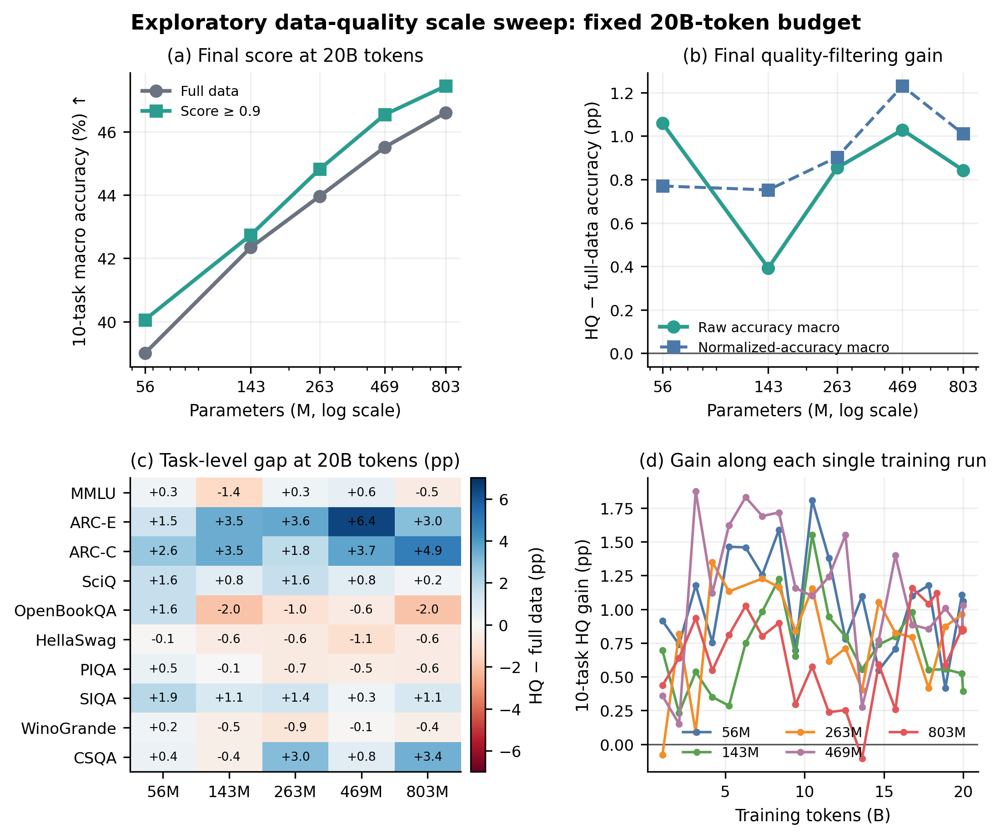

# 当前进展：先看这一份就够了

更新：2026-09-10。本文整合已经完成的实验，不是新训练成绩单。已重新拉取检查：HF EXPS 为 `4d45f05`，公开报告原版本为 `cdd9ac0`；截至本轮检查没有新的远端提交。原始结果和既有总结都已计入，不能把已经完成的补实验重新列为缺口。

## 1. 我们已经做了什么

| 工作 | 已完成规模 | 当前定位 | 要不要重做 |
|---|---|---|---|
| 英文质量 Scale：EXPS | 56M、143M、263M、469M、803M；每档两种质量；每次约 20B token，共 10 组 | 论文正文主结果一 | 不重做；143M/803M 额外种子延期 |
| 本地 43M 双语顺序初探 | 六种条件 × 两种子，共 12 run，每次约 100.66M token | 工程与方向先导 | 不重做 |
| 集群 43M 双语复现 | 六种条件 × 两种子，共 12 run，每次约 100.66M token | 与集群 143M 配成规模对照 | 不重做 |
| 集群 143M 双语扩展 | 六种条件 × 两种子，共 12 run，每次约 331.35M token | 论文正文主结果二 | 不重做 |
| 发布版中文零样本评测 | C-Eval、CMMLU、XCOPA-ZH、扩展 XWinograd-ZH；13,932 项 | 发布模型的描述性能力表 | 已有结果，本轮只核验 |
| 这轮指标复算与审计 | 同一批已保存的 JSON/逐题输出 | 修正解释和提高可追溯性 | 不是新训练、不是新增种子 |

六种条件是：只英文、只中文、IID 50:50、先英文后中文、先中文后英文、八块交替。因此，**IID 50:50 已经做过，而且已有两个规模的结果**。集群两规模合计 24 run，本地另有 12 run；不要把三批混成一个统一实验、也不要把发布版 400B 训练混进这 24 run。

目前并不是“只有一个小实验，等公司补大实验”。五档英文实验就是已有的重要大实验；43M→143M 也是已经完成的补充实验。

## 2. 第一组 Scale：挑教材有没有用

把模型想成学生，训练数据想成教材。我们让同一尺寸的两个学生都读约 200 亿个 token：一个读上游发布池，一个读分数至少 0.9 的更严格子集。token 是模型读写的文本单位，不等于一个汉字或一个英文单词。

| 模型大小 | 原池十任务平均准确率 | 严格筛选后 | 差值（百分点） | 提升的任务数 |
|---:|---:|---:|---:|---:|
| 56M | 39.00% | 40.05% | +1.06 | 9/10 |
| 143M | 42.34% | 42.74% | +0.39 | 4/10 |
| 263M | 43.96% | 44.81% | +0.85 | 6/10 |
| 469M | 45.51% | 46.54% | +1.03 | 6/10 |
| 803M | 46.60% | 47.44% | +0.84 | 5/10 |

五档平均都改善，说明这个选择值得研究；143M 只有四个任务提高，却仍能提高总分，说明少数科目的涨幅可以盖过其他科目的下降。百分点是相减后的差，例如 42.74%−42.34% 约等于 0.40 个百分点，不是提升 40%。

这张图和结果表保留在正文。附录收详细字段审计、每个 checkpoint 和完整分项，不是把整个大实验降为附录。

本轮额外核对发现：如果改变“怎样算总成绩”，结论强弱会变。143M 按任务等权是 +0.39 pp，但按任务题数加权的汇总近似是 −0.34 pp；去掉两项 ARC 后八任务平均为 −0.38 pp。这不是数据自相矛盾，而是不同总分给各科分配了不同权重。应事先说清主指标，并把不利敏感性结果一起公开，不能算到哪个正就用哪个。

另外，raw accuracy 与源 `acc_norm` 的 50 个任务×规模组合中，有 12 个收益符号不同。“HellaSwag 五档下降”仅适用于这里的 raw 口径，不能不加限定地概括为能力普遍退步。`acc_norm` 也不是“扣除随机猜测后的成绩”；历史精确归一化单位还需原评测配置确认。

因此当前可写：“固定约 20B token 的五档英文实验中，严格筛选提高最终等任务 raw 平均分，但效果非单调，且取决于任务和评分口径。”不能写“越大越受益”“发现普遍 scaling law”“所有任务都更好”。见[完整敏感性复算](QUALITY_METRIC_SENSITIVITY_CN.md)。

## 3. 第二组 Scale：中英教材怎样排课

这一组不是重新筛教材，而是在双语条件内保持语言比例和对应序列多重集一致，改变出现顺序。IID 好比每天穿插两科；单次切换好比先连续学很久英语，再连续学很久中文。

| 排课方式 | 43M 相对 IID 的等语言预测损失惩罚 | 143M 相对 IID 的惩罚 |
|---|---:|---:|
| IID 50:50 | 基准 0 | 基准 0 |
| 八块交替 | +4.57% | +4.62% |
| 先英文后中文 | +12.01% | +19.73% |
| 先中文后英文 | +23.89% | +36.41% |

这个表先在每种语言内部算“比 IID 差多少”，再给两种语言同样权重；它不是先平均两种语言的绝对 BPB 再相除。两种算法数值不同，旧报告两者都有，不能混用。

损失越低表示在相同文本上预测下一个 token 越好；它不是阅读题准确率。表中 36.41% 表示这个内部预测指标的相对代价，不能说“中文能力下降 36.41%”。

最值得进入正文的观察是：增加模型和训练量，并不会自动消除不好的排课方式。八块交替的相对代价约保持 4.6%，单次大切换的代价反而变大。这里同时增加了参数、token 和更新数，所以不能把变化全归因于“参数变大”。也没有测一串不同块长，不能推出“块越短必然越好”。

历史 BPB 实现只预测 1,024-token 块中的 1,023 个位置，但字节数覆盖整个解码块，特殊 token 处理也需修正。因此论文现在把它明示为历史打包块损失。相同语言、相同测试集内，单纯更正共同字节分母不会改变相对比值；但修复 EOS/边界会改变分子，仍需权重重评。已有顺序实验不能因此被说成“没做”，也不能因此直接称为标准逐文档 BPB 的确认性证明。

## 4. 已有中文评测说明了什么

| 发布模型任务 | 正确 / 题数 | 准确率 | 均匀随机参考 |
|---|---:|---:|---:|
| C-Eval validation | 349 / 1,346 | 25.93% | 25% |
| CMMLU test | 2,949 / 11,582 | 25.46% | 25% |
| XCOPA 中文 test | 289 / 500 | 57.80% | 50% |
| XWinograd 中文扩展 test | 300 / 504 | 59.52% | 50% |

前两项是按题数加权，不是学科等权平均。四项来自同一个发布 checkpoint 的已有 BF16 零样本评测，本轮把 121 个逐题文件与汇总核对了一遍，没有重新推理。XWinograd 是含 CLUE 补充项的版本，不能冒充原始 504 个中英平行题。

人话：中文考试型知识题目前没有表现出明显的整体优势；两种二选一任务有一定表现。不能把这四个分数包装成“中文全面领先”。同时，这些成绩不是 IID 与分块训练的对照，因此不能拿来证明 IID 导致提升。详见[中文评估审计](CHINESE_EVAL_AUDIT_CN.md)。

## 5. 创新与贡献：现在怎样说更稳

当前最可信的定位是：围绕超小型中英模型的数据选择与训练顺序，给出两组互补的经验研究，而不是发明新架构、宣称通用过滤规律。

正文核心一是五档英文质量收益及任务/指标差异；核心二是两档双语训练顺序如何影响规模收益的分配。发布模型与复现材料提供研究对象和可核查基础，但“整理得很齐”不能独自替代研究新知识。

我们希望最终形成“超小型双语训练配方”的故事。现有证据支持其中部分选择，却尚未直接验证中文质量筛选与双语混合的组合。可以诚实保留这一目标，不宜把完整配方写成已经受控验证完毕的贡献。昇腾只作为历史执行环境，不作为创新。

## 6. 下一步不是重做已有实验

按预算约束，143M/803M 的 20B 额外种子及 143M 3B 大矩阵均延期，不是当前开工要求。

优先回收已有受控 checkpoint，补逐题双语评测和规范文档级损失；这是评测，不是重训。其次才是拟议的 43M 小桥接：固定 IID 50:50，交叉控制英文/中文是否严格筛选，共四组、两种子、约 8.05 亿输入 token。它回答一个已有两组实验尚未直接回答的问题，不是重做英文五档 Scale。该方案尚未执行，训练适配器也未全部实现。

详细数据、取样、去重、精度、失败规则、预算上限和指标见 [IID 50:50 后续实验方案](IID50_EXPERIMENT_PLAN_CN.md)。若已有公司内部但未入库的同名四格结果，应先登记并复用，绝不按计划再跑一遍。

## 7. 论文目前到哪一步

两组 Scale 均进入当前论文正文，已撤去未完成结果的占位承诺，补入中文描述性结果和指标限制。能编译成 PDF 不等于已经具备接收条件；可复现记录、评测口径、成对双语证据和贡献连接仍须加强。

[ICLR 2027 作者指南](https://iclr.cc/Conferences/2027/AuthorGuidelines)规定初稿正文最多 9 页；北京时间摘要截止为 2026-09-19 19:59，全文截止为 2026-09-26 19:59。正式提交前仍须核对官方日程和匿名打包，公开 GitHub 仓库不能直接当匿名附件。

独立模拟审稿及作者回复另见 [模拟评审总览](ICLR_SIMULATION_CN.md)。分数是内部压力测试，不是真实 ICLR 分数，也不代表接收概率。补实验已经做过的证据必须计分，尚未做的计划不能提前计分。

## 8. 怎样找到材料

- 现在只想知道进展：读本文。
- 要在集群开工：读 IID 方案与配套 JSON；先通过开工检查。
- 想理解为什么评审不满意：读模拟评审总览。
- 要复查数字：保留原实验目录的 JSON、CSV、PNG 和脚本；旧报告加历史标记，不抹掉原始结果。
- 要看论文：以论文仓库 `output/pdf/haidass_iclr2027.pdf` 为唯一当前稿，不再生成多份报告 PDF。
