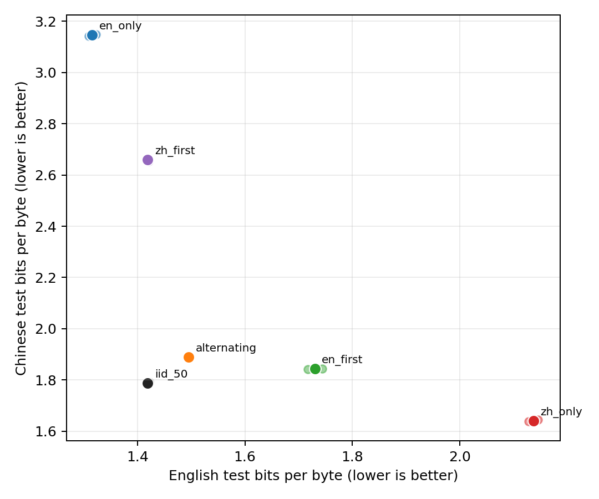

# Haidass 中英双语实验：小白也能看懂的完整解释

## 先说结论

这个实验想回答一个很实际的问题：**同一个小模型既学中文又学英文时，数据应该怎样安排？**

我们在同样的模型、同样的总训练量和同样的数据上，只改变中文、英文出现的先后顺序。结果是：

1. **把中英文持续随机混在一起训练最好。**
2. “先学完一种语言，再学另一种语言”会产生明显遗忘。
3. 遗忘是不对称的：先学中文再学英文时，中文损失特别严重；反过来，英文也会忘，但程度小得多。
4. 中英交替分块比“一口气学完一种语言”好，但仍比随机混合差约 5.5%。所以当前结果不支持把交替课程包装成创新算法。
5. 双语模型弱于单语专家，主要原因之一是每种语言看到的数据减半；在相同目标语言曝光量下，额外的“混合代价”小得多。不过这只是 43M 参数、两个随机种子的先导结果，还不能下统计显著性结论。

最重要的边界是：**这不是 Haidass1.5-143M 本体的重训结果。**它是用 RTX 2080 Ti 跑的 43.46M 参数代理实验，用来检查实验设计、训练代码和科学方向。它也不是对 Haidass 原始 400B-token 配方的复刻，因为模型卡没有公开五个来源的精确比例、训练阶段边界和具体 shard。

## 一、为什么要设计这个实验

可以把一个 43M 参数的小模型想成一个容量有限的学生。现在要求这个学生同时学中文和英文，会发生三类情况：

- **正迁移**：学英文形成的某些知识或推理方式也帮助中文，反之亦然。
- **数据稀释**：总课时不变，原来全部时间学中文，现在只有一半时间学中文。中文变弱可能只是“中文课时少了”，不一定是两种语言互相打架。
- **参数干扰或遗忘**：学生先学会中文，后来集中学习英文，英文训练把原来存放中文能力的参数改掉了。

如果只比较“最终双语模型”和“最终单语模型”，数据稀释和语言干扰会混在一起。我们无法知道模型变弱是因为中文数据少了一半，还是因为英文真的干扰了中文。

因此本实验同时设计了：

- 单语基线，用来知道“只学一种语言”能达到哪里；
- 随机双语基线，用来知道最普通的 50:50 混合效果；
- 多种语言顺序，用来检查“先后顺序是否导致遗忘”；
- 中途检查点，用来在**目标语言曝光量相同**时比较单语与双语模型，从而尽量拆开数据稀释和混合效应。

## 二、用了哪些数据，它们里面是什么

Haidass1.5 模型卡列出了五个训练数据仓库。我们全部覆盖，但不是把约 19.77 TB 的上游数据完整下载下来，而是为每个来源固定选择一个 Parquet shard。最终保存了 16 个 shard，共 8.541 GiB，并记录仓库 revision、文件路径和 SHA-256。

### 2.1 五个数据仓库的人话解释

| 数据仓库 | 里面大概是什么 | 在本实验中的作用 | 需要注意什么 |
|---|---|---|---|
| [Ultra-FineWeb](https://huggingface.co/datasets/openbmb/Ultra-FineWeb) | 经过质量筛选、清洗和去重的英文与中文网页正文，主题很杂，包括科普、教育、生活、技术、论坛和一般知识 | 提供中英文的通用语言和网页知识；也是验证集、测试集的来源 | 网页数据仍可能有事实错误、偏见和残余噪声 |
| [DCLM Baseline](https://huggingface.co/datasets/mlfoundations/dclm-baseline-1.0-parquet) | 从 Common Crawl 网页中经过启发式清洗、Bloom-filter 去重和 fastText 质量分类得到的英文正文 | 增加另一种英文网页分布，避免英文全来自一个仓库 | 主要是通用英文，不是专门的代码或数学数据 |
| [FineMath](https://huggingface.co/datasets/HuggingFaceTB/finemath) 的 `finemath-4plus` | Common Crawl 中筛出的高质量英文数学教育文本，偏重清晰解释、推理过程、分步解题、Markdown 和 LaTeX | 给模型补充数学说明和步骤化推理文本 | 只覆盖英文；“4plus”是质量筛选档，不表示题目难度四级 |
| [Ultra-FineWeb-L3](https://huggingface.co/datasets/openbmb/Ultra-FineWeb-L3) | 在 Ultra-FineWeb 上用模型合成的结构化数据：问答生成，以及百科、教材、博客、摘要等多风格改写；中英文都有 | 测试高可学习性、结构化合成文本对双语训练的影响 | 它是合成数据，可能带有生成模型偏差、模板化表达或幻觉 |
| [Cosmopedia](https://huggingface.co/datasets/HuggingFaceTB/cosmopedia) | Mixtral-8x7B-Instruct 生成的英文教材、博客、故事、帖子和 WikiHow 风格文章，种子来自网页、课程大纲、数学文本等 | 增加教育文本、常识故事和不同写作风格 | 全部是英文合成文本，不能把流畅当成事实一定正确 |

### 2.2 为什么五个仓库变成了 16 路数据

有些仓库内部有多个语言或配置。例如 Ultra-FineWeb 有英文和中文；Ultra-FineWeb-L3 有中英文问答与中英文多风格改写；Cosmopedia 有八个不同种子来源。因此训练时实际记录了 16 个 source ID。

下面是物化数据池的组成。每条序列固定为 1,024 tokens。英文池和中文池各有 102,400 条序列，也就是各 104,857,600 tokens。

| 训练流 | 语言 | 内容 | 序列数 | 该语言池占比 |
|---|---|---|---:|---:|
| `ultrafineweb_en` | EN | 高质量通用英文网页 | 30,720 | 30% |
| `dclm` | EN | 另一套清洗后的通用英文网页 | 16,384 | 16% |
| `finemath_4plus` | EN | 高质量英文数学教育内容 | 16,384 | 16% |
| `l3_en_qa` | EN | 英文网页知识改写成问答 | 8,192 | 8% |
| `l3_en_multistyle` | EN | 英文百科、教材、博客、摘要式改写 | 10,240 | 10% |
| 8 个 Cosmopedia 流 | EN | 数学、Khan Academy、OpenStax、Stanford、故事、两类网页和 WikiHow 合成文本 | 每流 2,560 | 合计 20% |
| `ultrafineweb_zh` | ZH | 高质量通用中文网页 | 61,440 | 60% |
| `l3_zh_qa` | ZH | 中文网页知识改写成问答 | 15,360 | 15% |
| `l3_zh_multistyle` | ZH | 中文百科、教材、博客、摘要式改写 | 25,600 | 25% |

Cosmopedia 的八个配置分别是：

- `auto_math_text`：以数学和科学网页片段为种子，生成面向不同年龄的教育文章；
- `khanacademy`：根据 Khan Academy 课程大纲生成教材；
- `openstax`：根据 OpenStax 课程单元生成教材；
- `stanford`：根据 Stanford 课程大纲生成课程型内容；
- `stories`：用通用问题和指令数据作种子生成常识故事；
- `web_samples_v1`、`web_samples_v2`：根据聚类后的网页主题生成教材、博客等内容；
- `wikihow`：根据 WikiHow 标题生成步骤式文章。

这些比例是**我们为了可控实验明确制定的比例**，不是 Haidass 团队公开的原始比例。Haidass 模型卡只列出了五个仓库，并没有给出每个仓库用了多少、各阶段怎么调整混合比例。

## 三、数据从网页文档变成训练样本的过程

可以把数据处理理解成下面这条流水线：

`固定仓库版本和文件 → 读取正文 → 去空和精确去重 → 用 Haidass tokenizer 分词 → 长度过滤 → 分训练/验证/测试 → 拼接并切成 1,024-token 序列`

具体过程如下。

### 3.1 固定版本和文件

每个数据仓库都固定到一个明确的 Git revision。每个 source 使用预先选定的 Parquet 文件，不会在重跑时临时换 shard。这样两个月后重新运行，读取的还是同一个文件。

### 3.2 文档清洗与精确去重

程序先取每条记录的正文；空文本直接丢弃。为了判断两篇文档是否完全重复，会做 NFKC Unicode 规范化、大小写折叠和空白合并，然后计算 SHA-256。哈希相同的文档只保留一份。

规范化文本只用于计算去重哈希，模型真正训练时仍使用原始正文。这次本地实验做了跨来源精确去重，但没有做成本更高的 MinHash 近重复去重；正式集群实验必须补上近重复和基准污染扫描。

### 3.3 分词和长度过滤

所有来源统一使用 Haidass1.5 的 64,000 词表 tokenizer。一个“token”可以是一个字、词的一部分、标点或常见字符串，并不等于一个汉字或一个英文单词。

分词后少于 200 tokens 或超过 8,192 tokens 的文档被过滤。每篇保留文档末尾加一个 EOS，表示“这篇文档结束了”。同一 source 的文档依次进入缓冲区，再连续切成长度 1,024 的训练序列。

因此，一条 1,024-token 序列可能包含一篇长文的一部分，也可能包含几篇短文；EOS 让模型知道文档边界。

### 3.4 训练、验证和测试怎么分开

Ultra-FineWeb 的英文和中文流被指定为评估来源。每篇文档根据加盐后的文档哈希，确定性地分到：

- 训练区：约 99%；
- 验证区：哈希桶中的 0.5%；
- 测试区：另外 0.5%。

最终每种语言保存：

- 102,400 条训练序列；
- 256 条验证序列；
- 512 条测试序列。

验证集在训练过程中定期查看，用于观察曲线和遗忘；测试集只在训练结束后计算最终指标。DCLM、FineMath、L3 和 Cosmopedia 在这个先导实验中只进入训练池，不进入内部测试集。

这样做的好处是中英文评估都来自同一类通用网页数据，比较顺序条件时比较干净。缺点是它仍属于内部 held-out 网页，不代表数学能力、问答能力或真实下游任务。正式论文还需要 Wikipedia 外部语言建模集，以及 Belebele、XCOPA 等中英配对任务。

## 四、模型到底怎么训练

### 4.1 模型在学什么

这是一个从头预训练的 decoder-only Transformer。训练任务非常简单：给模型前面的 token，让它预测下一个 token。

例如输入“北京是中国的”，正确的下一个 token 可能是“首都”。预测错得越离谱，loss 越大；预测越准，loss 越小。大量重复这个过程以后，模型逐渐学会语法、常识、文本结构和一部分知识关联。

### 4.2 模型和训练规模

- 参数量：43,461,504；
- 词表：64,000，与 Haidass1.5 tokenizer 一致；
- 上下文长度：1,024；
- 精度：FP16；
- 每个小 batch：4 条序列；
- 累积 8 次再更新参数，因此每次更新等效看 32 条序列；
- 每次更新处理 `32 × 1,024 = 32,768` tokens；
- 每个 run 更新 3,072 次，共 100,663,296 tokens；
- 6 个条件 × 2 个随机种子，共 12 个 run、1,207,959,552 训练 tokens。

优化器为 AdamW，峰值学习率 `1.5e-3`，先用 31 个 update 线性 warmup，再余弦下降到 0；`β1=0.9`、`β2=0.95`、weight decay `1e-5`、梯度裁剪 2.0。这些主要设置与论文的集群计划保持一致。

### 4.3 六组实验分别做什么

| 条件 | 训练顺序 | 它回答的问题 |
|---|---|---|
| `en_only` | 100% 英文 | 英文单语专家能达到多好；也是等曝光比较的参照 |
| `zh_only` | 100% 中文 | 中文单语专家能达到多好；也是等曝光比较的参照 |
| `iid_50` | 每条序列随机决定中/英文，总量严格 50:50 | 最普通、最强的双语基线 |
| `en_first` | 前半程全英文，后半程全中文，即 `EEEEZZZZ` | 集中学完英文再学中文，会不会忘英文 |
| `zh_first` | 前半程全中文，后半程全英文，即 `ZZZZEEEE` | 集中学完中文再学英文，会不会忘中文 |
| `alternating` | 八个等长块交替，即 `EZEZEZEZ` | 缩短连续单语阶段能否减轻遗忘 |

四个双语条件都严格使用 50,331,648 个英文 tokens 和 50,331,648 个中文 tokens。同一个 seed 内，它们使用完全相同的英文序列和中文序列，只改变这些序列出现的顺序。因此结果差异不能简单归咎于某组“抽到了更好的数据”。

### 4.4 为什么要跑两个随机种子

模型初始化和数据抽样包含随机性。只跑一次，结果可能恰好是运气。这里用 seed 2027 和 2028 重复整个矩阵，并且每个 seed 内六个条件从完全相同的初始参数开始。

两个 seed 只能检查方向是否大致重复，不能提供可靠的显著性检验。正式实验至少需要三个 seed，并对文档级结果做 bootstrap 或层级统计分析。

## 五、结果为什么看 BPB，而不是只看 loss

### 5.1 BPB 是什么

BPB 是 bits per byte，可以粗略理解为：**模型平均需要多少信息量来描述原文的每一个 UTF-8 字节。越低说明模型越能预测这类文本。**

如果把语言模型想成压缩器，熟悉一种语言的模型更容易压缩这种语言，BPB 就更低。

中文和英文被 tokenizer 切分的方式不同，直接比较 token perplexity 容易受到“一个 token 包含多少字符”的影响。BPB 用原文 UTF-8 字节做分母，更适合在同一个 tokenizer 下分别报告中英文语言建模能力。

BPB 不是准确率。`1.42` 也不是“正确率 142%”。它只在同一评估集、同一计算方法下用于比较，数值越低越好。

### 5.2 遗忘指标是什么

训练过程中每隔 192 个 update 在验证集上测一次。某语言的遗忘量定义为：

`最终 BPB − 训练过程中该语言曾达到的最好 BPB`

- 等于 0：最后没有比此前最佳点更差；
- 大于 0：模型曾经学得更好，后来又退步了；
- 数值越大：遗忘越严重。

### 5.3 “平均值 ± sample SD”是什么

表中的平均值来自两个 seed。`±` 后面是两个结果之间的 sample standard deviation，用来显示重复运行波动多大。它不是置信区间，也不代表已经达到统计显著。

## 六、最终结果怎么读

### 6.1 先只看四个双语方案

| 双语方案 | 英文测试 BPB | 中文测试 BPB | 中英等权平均 | 相对 IID 平均变化 |
|---|---:|---:|---:|---:|
| IID 50:50 随机混合 | **1.4191 ± 0.0038** | **1.7885 ± 0.0043** | **1.6038 ± 0.0040** | 基准 |
| 八块交替 | 1.4954 ± 0.0021 | 1.8896 ± 0.0012 | 1.6925 ± 0.0016 | **差 5.53%** |
| 先英文后中文 | 1.7303 ± 0.0188 | 1.8430 ± 0.0013 | 1.7866 ± 0.0100 | **差 11.40%** |
| 先中文后英文 | 1.4189 ± 0.0023 | 2.6592 ± 0.0073 | 2.0391 ± 0.0025 | **差 27.14%** |

这里的中英等权平均只是方便快速排序；论文中仍应把英文和中文分别作为主要结果，避免一个平均数掩盖某种语言的大幅退化。

**IID 随机混合最好。**它在英文、中文和平均 BPB 上都优于交替分块。说明对于这个 43M 模型和 100.66M-token 预算，频繁、随机地同时看到两种语言，比人为安排大块课程更稳。

**八块交替没有打败 IID。**相对 IID，英文 BPB 高 0.0763，约差 5.37%；中文高 0.1011，约差 5.65%。它比长时间只学一种语言安全，但不是改进。

**先英文后中文会忘英文。**最终英文比 IID 差约 21.92%，英文遗忘为 `0.3040 ± 0.0138 BPB`。曲线显示模型在前半程把英文学好后，切换到中文时英文能力明显反弹变差。

**先中文后英文对中文伤害最大。**最终中文比 IID 差约 48.69%，中文遗忘达到 `0.8785 ± 0.0172 BPB`。它的英文结果与 IID 几乎一样，但这是用严重牺牲中文换来的，不能叫更好的双语模型。

图中向下表示变好，向上反弹表示退步。垂直虚线是八个训练块的边界。绿色和紫色曲线在语言切换后明显反弹，就是遗忘的直观证据；橙色交替曲线每次切换都会出现波动。

### 6.2 双语模型为什么不如单语专家

最终测试集上：

- 英文单语专家的英文 BPB 是 `1.3158 ± 0.0094`；IID 双语是 `1.4191 ± 0.0038`。
- 中文单语专家的中文 BPB 是 `1.6413 ± 0.0048`；IID 双语是 `1.7885 ± 0.0043`。

表面看，双语模型比英文专家差约 7.85%，比中文专家差约 8.97%。但不能立刻说这是“语言互相干扰”，因为单语专家看了约 100.66M 个本语言 tokens，而双语模型每种语言只看了约 50.33M。

这就像比较一个上了 100 小时英语课的学生，与一个只上了 50 小时英语、另外 50 小时中文的学生。后者英语弱，不一定是中文破坏了英语，也可能只是英语课少了一半。

### 6.3 相同语言课时下再比较

为了控制“课时”，我们比较：

- 单语模型训练到一半：已经看过约 50.33M 个该语言 tokens；
- IID 双语模型训练结束：也看过约 50.33M 个该语言 tokens。

这里使用训练过程中固定保存的 validation BPB：

| 语言 | 单语模型 @ 50.33M | IID @ 50.33M/语言 | IID − 单语 | 再增加 50.33M 单语数据的收益 |
|---|---:|---:|---:|---:|
| 英文 | 1.4033 ± 0.0133 | 1.4144 ± 0.0045 | +0.0111 ± 0.0178 | 0.0894 ± 0.0050 |
| 中文 | 1.7805 ± 0.0081 | 1.8077 ± 0.0056 | +0.0272 ± 0.0025 | 0.1166 ± 0.0014 |

人话解释：

- 当英文课时一样时，双语混合只比英文单语高 0.0111 BPB；两个 seed 中一个为正、一个略为负，所以英文方向并不稳定。
- 当中文课时一样时，双语混合比中文单语高 0.0272 BPB；两个 seed 方向一致，但样本仍太少，暂时只能叫“中文混合代价的初步迹象”。
- 单语模型继续多看 50.33M 本语言 tokens，可以再改善英文 0.0894、中文 0.1166 BPB。这个量明显大于当前观察到的等曝光混合差值。

因此目前更合理的解释是：**双语专家差距中，相当一部分来自每种语言分到的数据变少；残余的语言混合代价存在初步迹象，中文比英文更明显。**不能把最终专家差距全部叫作参数干扰。

### 6.4 最终双语权衡图

横轴是英文 BPB，纵轴是中文 BPB，越靠左下越好。黑色 IID 点位于四个双语方案中最靠左下的位置。紫色“先中文后英文”虽然英文不错，但中文非常差；绿色“先英文后中文”则牺牲了英文。

## 七、我从结果里得到的洞见

### 洞见 1：IID 是必须认真对待的强基线

课程设计听起来比随机混合高级，但在这个实验里，最简单的 IID 反而最好。论文不应该先假设“我们提出的课程一定更强”，而应允许实验得到负结果或零结果。

当前最诚实的表述是：**长语言块产生遗忘，缩短块能缓解但没有超过 IID。**如果集群实验仍然如此，这本身也是有价值的结论，可以避免其他小模型训练者浪费算力在未经验证的分块课程上。

### 洞见 2：中英双语的主要矛盾可能首先是数据预算，不是神秘的“语言冲突”

双语模型在固定总 token 预算下，每种语言只能分到一部分数据。等曝光比较显示，当前混合代价远小于继续增加同语言数据带来的收益。实践上，想提高双语能力，第一优先级可能是增加总训练 token 或更合理地分配比例，而不是先发明复杂训练顺序。

### 洞见 3：中文遗忘明显更脆弱，但原因还不知道

先中文后英文产生约 0.8785 BPB 的中文遗忘，而先英文后中文的英文遗忘约 0.3040。这个不对称在两个 seed 都出现，因此值得在 143M 上重点验证。

但本实验不能断言原因。可能解释包括：

- 英文来源更多、更杂，后半程英文梯度覆盖了更多共享参数；
- 中文和英文在 64K tokenizer 中的切分效率不同；
- 43M 模型容量太小，中文表征更容易被覆盖；
- 中英文训练池的原始难度和合成数据比例不同；
- 测试集是通用网页，可能更接近某些训练来源。

这些都是下一步假设，不是已经证明的事实。

### 洞见 4：真正可作为论文核心的不是“交替课程算法”

基于当前结果，更稳妥的论文创新点应是：

1. 在固定模型容量和总 token 预算下，把双语差距拆成数据稀释与等曝光混合效应；
2. 用完全相同的文档多重集做语言顺序干预，测量非对称遗忘；
3. 同时报告中英文 BPB、遗忘轨迹和配对双语任务，而不是用单一英文榜单分数代替双语证据。

“交替训练更好”目前不成立，不应写成贡献。

## 八、这个实验能证明什么，不能证明什么

### 可以支持的先导结论

- 12 个 run 的训练和评估流水线可复现并通过审计；
- 在当前代理规模，IID 50:50 优于三种分块顺序；
- 长时间单语阶段会造成明显遗忘；
- 中文在中文→英文切换中的遗忘比反方向更大；
- 等曝光比较是必要的，不能把专家差距全部解释成语言干扰。

### 目前不能支持的结论

- 不能说 Haidass1.5-143M 本体一定具有相同现象；
- 不能说中文干扰已经达到统计显著；
- 不能说某个课程优于 IID；
- 不能说这些 BPB 差异必然转化成问答、推理或生成能力差异；
- 不能声称复刻了 Haidass 的 400B-token 原始训练配方；
- 不能根据两个 seed 报正式置信区间或论文级非劣检验。

## 九、上集群后应该怎么验证

下一阶段建议按以下顺序做：

1. **43M 放大确认**：把每 run 从 100.66M 提高到约 1B tokens，至少三个 seed；先确认 IID、交替、先英后中、先中后英的排序是否保持。
2. **语言比例扫描**：比较中文占比 25%、50%、75%，找中英 Pareto 前沿，而不是默认 50:50 一定最好。
3. **143M 目标实验**：固定预注册方案后再跑 Haidass 尺寸模型，比较单语、IID、最佳非 IID 和随机块顺序控制。
4. **外部语言建模集**：除内部 Ultra-FineWeb held-out 外，再使用独立 Wikipedia 中英文文本，防止结论只适用于一个网页来源。
5. **中英配对任务**：使用 Belebele、XCOPA 等同题中英版本，统计两种语言都答对、只英文答对、只中文答对和答案一致性。
6. **污染和近重复审计**：加入 MinHash 近重复删除，并对所有下游题目做训练数据重叠扫描。
7. **统计分析**：至少三个训练 seed；语言建模按文档 bootstrap，配对任务按同一题的中英文成对 bootstrap。

如果 143M、更多 tokens 和更多 seed 下仍然出现“中文在后续英文训练中更容易遗忘”，这才有资格成为论文的主要实证发现。

## 十、实验完整性和运维说明

审计确认：

- 12/12 个计划 run 完成；
- 每个 run 都有完整的 3,072 条训练记录和 17 次验证记录；
- 同 seed 的六个条件共享相同初始化；
- 四个双语条件共享相同的中英文序列多重集；
- 配置、schedule、metrics 和最终权重 SHA-256 一致；
- 没有非有限 loss 或 gradient，FP16 scale 没有因 overflow 下调；
- 活跃 run 目录没有残留临时文件。

最后一个 `alternating-s2028` 的首次尝试在 RTX 2080 Ti 达到 84°C 并报告软件温控降频后被人工停止，现场被保留在 `runs/interrupted`。随后使用完全相同的初始化、数据顺序和优化设置重跑，只在每次参数更新后额外等待 250 ms。重跑完整通过审计。部分 run 跨越 Windows 主机挂起，因此 wall-clock 时间不能用于性能比较；训练中的 active-compute median throughput 才是可用的运行效率记录。

## 十一、去哪里看原始结果

- [严格版中文实验报告](EXPERIMENT_REPORT_CN.md)
- [每个条件的两 seed 原始汇总](tables/final_metrics_per_seed.csv)
- [两 seed 平均与标准差](tables/final_metrics_aggregate.csv)
- [等语言曝光分解](tables/matched_exposure_decomposition.csv)
- [完整训练与验证曲线](figures/validation_bpb_curves.png)
- [训练 loss 曲线](figures/training_loss_curves.png)
- [独立 run 审计](../p0_scaled_100m_all_sources_2080ti_run_audit.json)
- [数据仓库、revision 和许可证清单](../HAIDASS_DATASET_INVENTORY_CN.md)
- [实际实验配置](../../configs/p0_scaled_100m.json)
