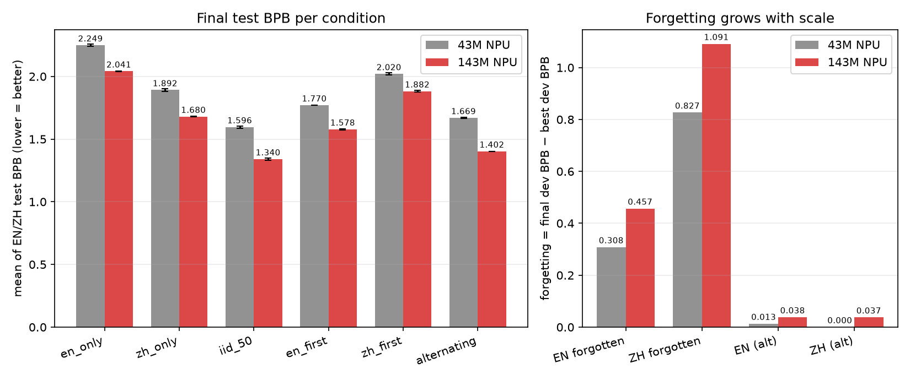
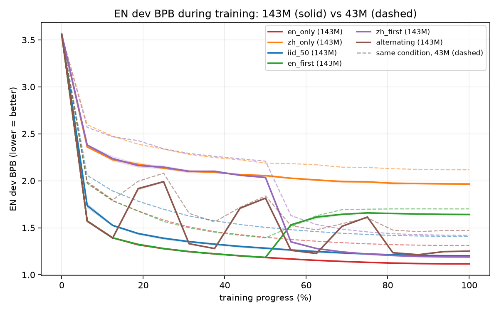
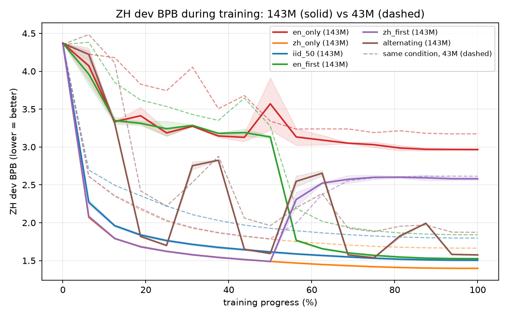
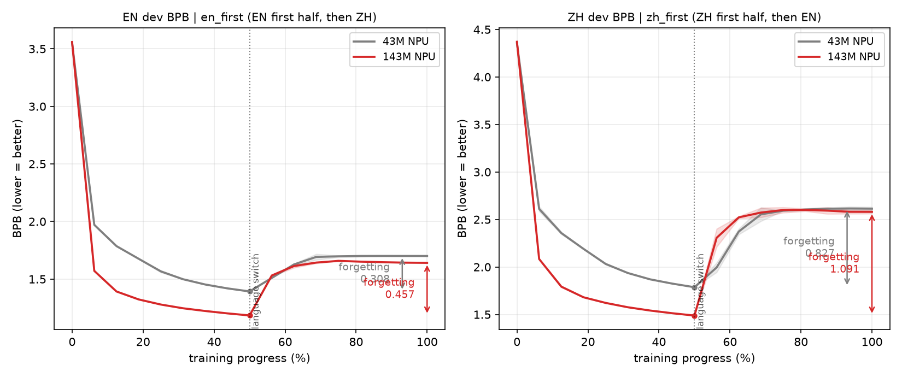

# 143M 双语实验报告（小白版）

日期：2026-09-04 ｜ 配套技术版报告：`EXPERIMENT_REPORT_CN.md`

> **一句话总结**：我们把上次的双语训练实验从 43M 小模型放大到 143M（3.3 倍），发现上次总结的规律**全部成立**，而且"学完一种语言再学另一种会忘掉前一种"这个问题，模型越大反而**越严重**。

---

## 1. 先回顾：上次实验发现了什么

我们在训练一个会中文和英文的小模型。一个很实际的问题是：

> 两种语言的数据，按什么顺序喂给模型最好？

上次用 43M 的小模型试了 6 种喂法：

| 条件名 | 大白话解释 |
|---|---|
| `iid_50` | 中英文全程打乱混着喂（随机 50:50） |
| `en_only` | 只喂英文（对照组） |
| `zh_only` | 只喂中文（对照组） |
| `en_first` | 前半程全英文，后半程全中文 |
| `zh_first` | 前半程全中文，后半程全英文 |
| `alternating` | 中英文按大块交替着喂 |

上次的结论是：**打乱混着喂（iid_50）效果最好**；先喂一种再喂另一种会导致先学的语言被忘掉不少；中文比英文更容易被忘掉。

但有人会质疑：**这些规律会不会只是小模型才有的怪癖？** 模型大了会不会就不一样了？这次实验就是来回答这个问题的。

## 2. 这次做了什么：同一个实验，放大 3.3 倍

做法特别朴素，可以理解成"**同样的食谱，换一口 3.3 倍大的锅**"：

- 模型：43M → **143M** 参数（3.3 倍）
- 每个实验喂的数据：1 亿 → **3.3 亿** token（也放大 3.3 倍，保证"每份参数吃到的数据"不变）
- 其他所有设置（学习率、批次大小、评测题目……）**一个都不改**

这样，143M 和 43M 的唯一区别就是"个头"，结论的差别就一定是规模引起的。数据池变大时我们还特意验证了：新池子的**考题（dev/test 集）和旧池子一模一样**（逐字节相同），这样两次实验的分数可以直接比。

一共跑了 **12 组训练**（6 种喂法 × 2 个随机种子），用了集群上的 4 张 NPU 卡（物理 4/5/6/7 号），训练约 7 小时，评测约 1 小时。

### 名词小卡片

- **BPB（bits per byte）**：模型"考砸程度"的分数。**越低越好**，低 0.1 就是肉眼可见的进步。
- **遗忘（forgetting）**：训练过程中某语言考得最好的一次，和训练结束时的分差。比如先喂英文时英文考到 1.2，后面喂中文把它"挤"忘了，英文掉到 1.66，遗忘就是 0.46。
- **种子（seed）**：随机数起点。每种喂法跑 2 个种子，是为了确认结果不是运气好/差。

## 3. 结果（带图）

### 3.1 先看总账：所有喂法都变好了，但排名纹丝不动

**左图怎么看**：每组柱子是一种喂法，灰色是 43M、红色是 143M，柱子越矮越好。误差线是两个种子的波动。

- 所有红柱都比灰柱矮——模型变大，成绩全面提高（143M 最好的 iid_50 比 43M 好 16%），这是预期内的"规模红利"。
- **关键是柱子的排名完全没变**：两个规模上都是 `iid_50` 最好，然后依次是 `alternating` → `en_first` → `zh_only` → `zh_first` → `en_only`。上次总结的规律不是小模型特有的。

**右图怎么看**：这是"遗忘量"的柱子，后面 3.3 节细说——红柱明显高于灰柱，**遗忘随规模变大**。

### 3.2 训练过程曲线：放大后故事的形状一模一样

**怎么看**：横轴是训练进度（%），纵轴是该语言的 dev BPB（越低越好）。实线是 143M，同颜色的虚线是 43M。

- 两张图里实线整体都在虚线下面：143M 全程都比 43M 强。
- 但曲线的**形状**在两个规模上高度一致：
  - 蓝线（iid_50）一路平稳下降到最低——打乱混喂，两门语言一起进步，谁也不拖累谁。
  - 绿线（en_first）在英文图上先降**后升**——前半程英文越学越好，后半程改喂中文后英文成绩被"挤"回去了。中文图上的紫线（zh_first）是镜像。
  - 棕色锯齿线（alternating）在两张图上来回波动——每次换语言都会"踩"另一种语言一脚。

### 3.3 本次最重要的发现：遗忘随规模**变大**了

**怎么看**：左图是 en_first 的英文 dev 曲线（先英后中），右图是 zh_first 的中文曲线（先中后英）。中间竖虚线是"换语言"的时刻。曲线最低点到终点的落差就是遗忘量，图里用箭头标出。

- 换语言之后，先学语言的曲线都明显**反弹**——这就是遗忘的实锤。
- 红色（143M）的反弹幅度比灰色（43M）**更大**：
  - 英文遗忘：0.308 → **0.457**（变严重 48%）
  - 中文遗忘：0.827 → **1.091**（变严重 32%）
- 中文遗忘（1.091）仍然大约是英文遗忘（0.457）的 **2.4 倍**，"中文更怕忘"的不对称性保持。
- 另外一个新现象：`alternating` 在 43M 时中文完全不遗忘，143M 时开始遗忘 0.037——块交替的副作用在更大规模上也开始冒头。

直觉上可以这样理解：模型越大，前半程把先学的语言"学得越透"，后半程被改写时损失就越大。所以**不要指望"模型大了自然就不忘了"——恰恰相反**。

### 3.4 一个几乎不变的数字

`alternating` 比 `iid_50` 差多少？43M 时差 4.56%，143M 时差 4.63%——**块交替的代价几乎不随规模变化**。这暗示它是数据顺序本身造成的固有代价，而不是模型容量问题。

## 4. 给实际双语训练的建议（143M 证据加强版）

1. **首选全程打乱混喂（IID）**。两个规模、两个种子上它都是第一名，没有例外。
2. **避免"先集中学一种语言、再学另一种"的安排**。如果工程上不得不分阶段（比如数据后到手），后训阶段的另一种语言占比要加大，而且模型越大，遗忘越深，补偿要越多。
3. **退火期（训练收尾阶段）千万别把中文抽空**。中文在两个规模上都明显更怕被忘，收尾阶段的中文占比尤其要保住。
4. **如果必须分段交替，块越短越好**，但要心里有数：它永远追不上全程混喂（稳定差 ~4.6%），只能当工程折中，不能当提点手段。

## 5. 这份报告的边界（别把结论用过头）

- 这还是**探索性实验**：只有 2 个种子、上下文长度 1024、每个 run 3.3 亿 token，没做下游任务（问答、翻译等）评测。
- 结论在 43M→143M 区间一致，外推到 1B+ 大模型之前，需要计划书中的 P2 确认性实验（30 亿 token/run、3 个种子、下游评测）来背书。

## 6. 附录

### 6.1 数字总表（两个种子的均值 ± 波动）

| 喂法 | 指标 | 43M（NPU） | 143M（NPU） | 变化 |
|---|---|---:|---:|---:|
| en_only | 平均测试BPB | 2.2491 ± 0.0104 | 2.0412 ± 0.0038 | −0.208 |
| zh_only | 平均测试BPB | 1.8920 ± 0.0099 | 1.6798 ± 0.0024 | −0.212 |
| iid_50 | 平均测试BPB | 1.5962 ± 0.0091 | **1.3403 ± 0.0090** | −0.256 |
| en_first | 平均测试BPB | 1.7703 ± 0.0009 | 1.5783 ± 0.0050 | −0.192 |
| zh_first | 平均测试BPB | 2.0200 ± 0.0080 | 1.8820 ± 0.0072 | −0.138 |
| alternating | 平均测试BPB | 1.6690 ± 0.0037 | 1.4024 ± 0.0011 | −0.267 |
| en_first | 英文遗忘 | 0.3080 ± 0.0038 | **0.4568 ± 0.0015** | **+0.149** |
| zh_first | 中文遗忘 | 0.8268 ± 0.0181 | **1.0912 ± 0.0181** | **+0.264** |
| alternating | 英/中遗忘 | 0.013 / 0.000 | 0.038 / 0.038 | 双双上升 |

完整 30 行分语言数据见 `comparison_143m.md` / `comparison_143m.json`。

### 6.2 东西都在哪

- 本报告 + 技术版报告：`bilingual_npu_cluster/training/results/`
- 图：`bilingual_npu_cluster/training/results/figures/`（画图脚本 `training/plot_143m_figures.py`，可重复生成）
- 训练/评测原始产物：`training/runs_143m/<喂法>-s<种子>/`
- 实验配置：`umeko_reports/configs/p1_143m_proportional.json`
