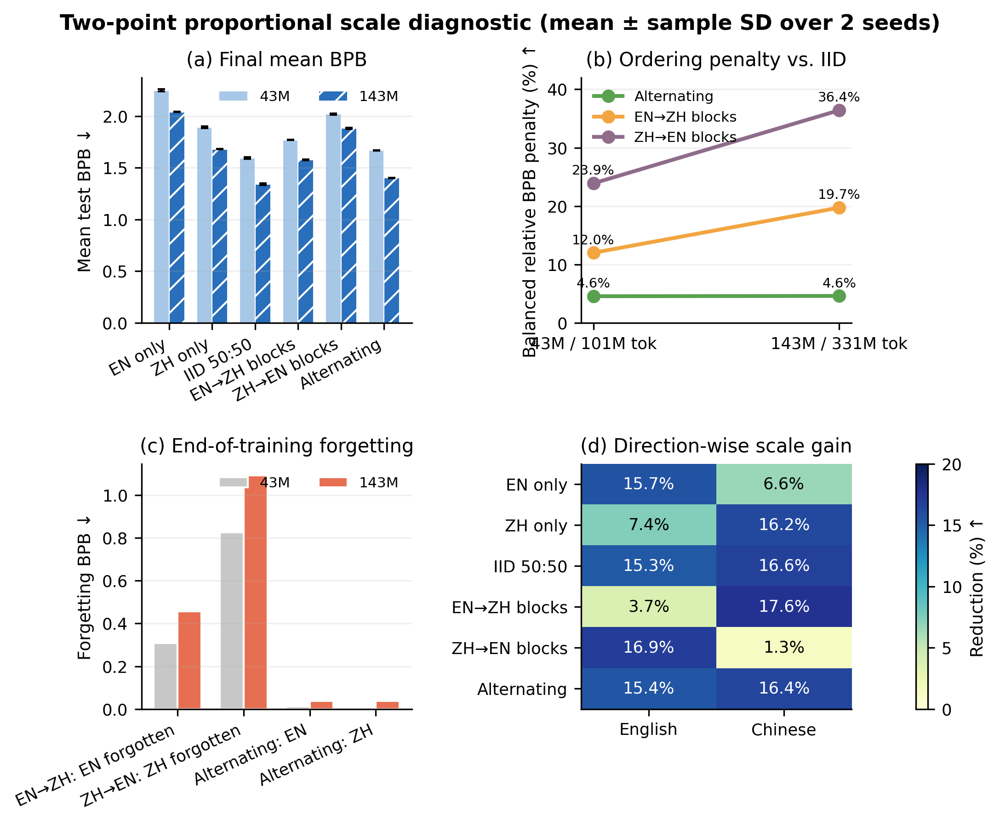

# 给“小白中的小白”看的 Scale 实验解释

## 先说最简单的答案

我们做了一件很像“换大脑、也多读书”的实验：

- 小模型有约 4300 万个参数，读了约 1 亿个 token。
- 大模型有约 1.43 亿个参数，读了约 3.31 亿个 token。
- 模型和读书量都扩大了约 3.3 倍。

结果很清楚：**大模型总体更会预测文字，但是中英文必须从头到尾打散混着学。先把一种语言学完，再突然只学另一种，会把先学的语言忘掉，而且这次放大后问题没有自己消失。**



## 一、参数、token、Scale 是什么

### 参数是什么

你可以把参数想成模型脑子里很多很多个“小旋钮”。训练就是不停调整旋钮。

- 43M 大约是 4300 万个旋钮。
- 143M 大约是 1.43 亿个旋钮。

旋钮更多，一般能记住更复杂的规律，但不是只要旋钮多就自动聪明。

### token 是什么

模型不是按整本书读文字，而是先把文字切成小块，这些小块叫 token。训练 token 数可以粗略理解成“读了多少教材”。

### Scale 是什么

Scale 就是把实验做大。这里不只把脑子变大，也让它读更多教材：两者都扩大约 3.3 倍。

所以这次能回答的是：

> “脑子和教材一起按比例扩大，原来的训练规律还在不在？”

不能回答的是：

> “只因为脑子变大，结果变了多少？”

因为教材数量也一起变了。

## 二、六种训练方法是在干什么

假设要教一个孩子中文和英文：

| 实验名 | 大白话 |
|---|---|
| EN only | 只上英语课 |
| ZH only | 只上中文课 |
| IID 50:50 | 把中英文教材充分洗牌，每批都可能有两种语言 |
| EN→ZH blocks | 前半学期只学英文，后半只学中文 |
| ZH→EN blocks | 前半学期只学中文，后半只学英文 |
| Alternating | 英文上一大段，中文上一大段，如此交替八块 |

每种方法跑两次，随机起点分别叫 seed 2027 和 2028。两次结果很接近，说明排序不是明显的一次好运气；但两次仍然太少，不能当成非常强的统计证明。

## 三、BPB 是什么，怎么看

BPB 可以理解成“模型看到考试文字时有多吃惊”。

- 越低越好。
- 1.3 比 1.6 好。
- 它不是百分制，也不是正确率。
- 它只能说明模型更会预测这类文字，不能直接说明会推理、会聊天或会翻译。

图中的柱子越低，说明考试表现越好。柱子上很小的黑线表示两次训练之间的差异。

## 四、最重要的结果是什么

### 结果一：变大以后，所有方法都变好

例如，中英文打散混着学的平均 BPB：

```text
小模型：1.5962
大模型：1.3403
```

下降约 16%。这是好事，说明“更大的模型 + 更多教材”确实兑现了整体收益。

### 结果二：混着学一直最好

大模型的最终成绩：

```text
充分打散混合：1.3403  ← 最好
大块交替：    1.4024
先英后中：    1.5783
先中后英：    1.8820
```

这里分数越低越好。最简单的建议就是：**正常预训练不要把所有中文集中在前面、所有英文集中在后面。**

### 结果三：最后学什么，模型就偏向什么

先英文、后中文时，大模型最后的中文只比混合训练差约 1.25%，但英文差了约 38.22%。

先中文、后英文时，英文甚至比混合训练好约 1.21%，但中文差了约 74.02%。

这就像一个学生期末前只突击最后一门课：最后一门可能很好看，但前一门被忘得很厉害。不能因为一门考得高，就说总方案更好。

### 结果四：放大带来的好处，被训练顺序吃掉了

在正常混合训练里，英文和中文扩大后都改善约 15%–17%。

但是：

- 先英文后中文：英文只改善 3.7%。
- 先中文后英文：中文只改善 1.3%。

换一种更形象的说法：正常混合本来给英文发了“100 元规模奖金”，先英后中最后只留下约 29 元；正常混合本来给中文发了“100 元规模奖金”，先中后英最后只留下约 12 元。其余好处被后半段只学另一种语言的过程冲掉了。

## 五、遗忘是什么

训练过程中，我们不只在最后考试，还会中途考试。

如果某门语言中途最好的分数是 1.20，最后变成 1.65，因为 BPB 越低越好，所以它退步了 0.45。这 0.45 就叫遗忘量。

实验中：

- 先英后中，英文遗忘从小模型的 0.308 增到大模型的 0.457。
- 先中后英，中文遗忘从 0.827 增到 1.091。

这说明扩大后，长块切换造成的坑没有自动消失。但我们只能说“这次实验观察到了”，不能说“世界上所有大模型都会这样”。

## 六、大块交替为什么比一次切换好，却仍不如打散

大块交替会多次回头复习前一种语言，所以比“学完一种永远不再回头”好。

但每个块内部仍然连续很久只看一种语言，可能出现“学这门、忘那门”的来回摆动。最终它在两个模型规模上都比充分打散差约 4.6%。

这只是根据曲线提出的下一步解释，现有数据还没有比较 2 块、4 块、16 块、32 块，不能说已经证明了最佳块长。

## 七、这是不是 scaling law

不是。

Scaling law 通常需要很多不同大小的模型和训练量，在多个点上看出稳定数学规律。我们现在只有两个点：43M 和 143M。两个点永远能连成一条线，但那条线不一定能预测 300M、1B 或更大的模型。

准确名称应该是：**两点成比例 Scale 对照**。

## 八、这是不是公开 Haidass1.5 模型本身的成绩

也不是。

143M 实验使用了和 Haidass1.5 相同的模型结构尺寸，但重新随机初始化，只训练了 3.31 亿 token。公开 Haidass1.5 模型卡写的是约 4000 亿 token，两者训练量差三个数量级。

所以这组实验是“实验室里的受控小实验”，目的像用小白鼠研究规律；不能把分数说成公开模型的完整能力。

## 九、三处仓库分别发现了什么

### `umeko_reports`

这里确实新增了可分析的集群结果：

- 43M 在 NPU/MindSpeed 上复现了原先 2080 Ti 的排序。
- 143M 做了 12 个成比例放大运行。
- 两个规模合计有 24 个 NPU 运行终点，可以做本报告的 Scale 对照。

### `ICLR-2027-Conference-Submissions`

这个仓库拉取后没有比 2026-08-31 更新的集群实验提交，论文仍保留 3B-token、3-seed 确认实验的占位符。因此当前 331M-token、2-seed 结果只能加入“探索性 Scale 诊断”，不能拿去填确认性主结果。

### Hugging Face `DALabCommunity/EXPS`

截至 2026-09-09，仓库地址在已登录 API 下仍返回不存在，模型、数据集和 Space 三种类型都是 404。也就是说这次没有拿到 EXPS 的更多 scale 点。我没有偷偷把别的数据当成 EXPS，也没有假装分析完成。

## 十、下一步最值得花算力做什么

如果只选一件事：**固定 143M 和总训练量，改变语言块的长度。**

例如比较：每条都混、2 大块、4 块、8 块、16 块、32 块。这样能回答“多久切换一次语言才不会明显遗忘”。

然后再补两种实验：

1. 教材完全一样，只换 43M/143M 脑子——看纯模型大小。
2. 脑子固定 143M，只读 1 亿/3.3 亿/10 亿/30 亿 token——看纯训练量。

只有把这两个因素拆开，并加入更多规模点和至少三个随机种子，才能开始谈真正的 Scaling 规律。

